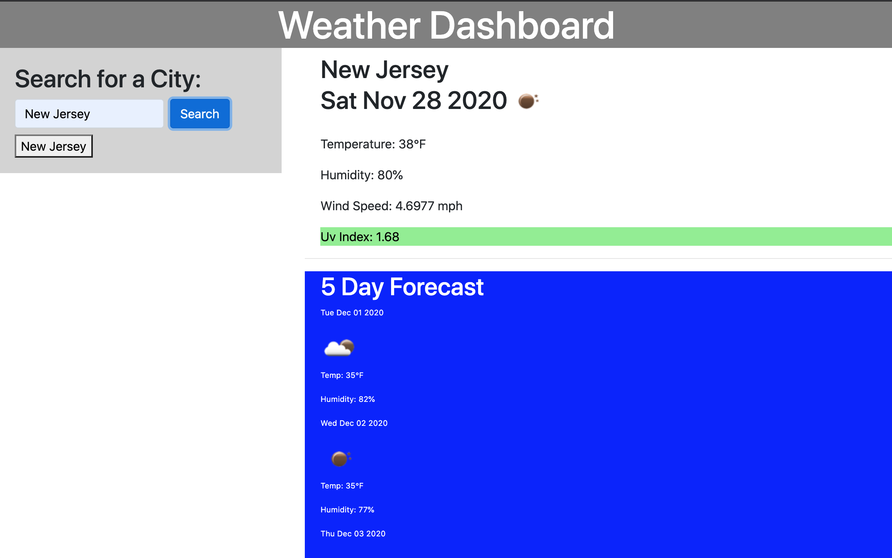

# weather-dashboard

## Overview

For this assignment I had to use the open weather api to create a search for weather in cities the user inputs. I was to create a search button using forms as well as dynamically creating html through jquery and calling on the api to get the daily weather and a five day forecast on the same city.

To do this I had to create 3 api calls, I then saved each city locally to storage and created a button based off of the city they had searched and added the buttons dynamicaly so the user could go back to a previously searched city.

[Link](https://lilipcohen.github.io/weather-dashboard/)
